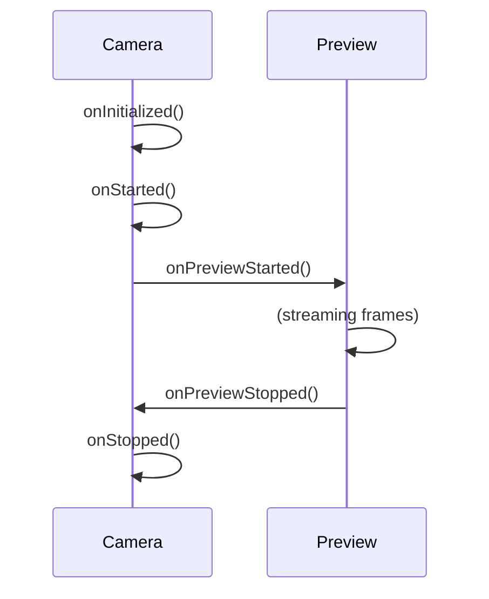

## The `isActive` prop

The `isActive` boolean prop controls whether the camera session is actively streaming frames. Setting `isActive={false}` **pauses** the session but keeps it warm — resuming is significantly faster than unmounting and remounting the `<Camera>` component.

```tsx
<Camera
  style={StyleSheet.absoluteFill}
  device={device}
  isActive={isActive} // toggle this instead of unmounting
/>
```

<Warning>
  On iOS, the system shows a green indicator dot in the status bar whenever the camera is active, even if the user has navigated away from your screen. Always set `isActive={false}` when the camera view is not visible to avoid alarming users and wasting battery.
</Warning>

## Pausing the camera on navigation

You should pause the camera whenever the user navigates to another screen or backgrounds the app. Combine `useIsFocused` from React Navigation with an app-state hook:

```tsx
import { useIsFocused } from '@react-navigation/native'
import { useAppState } from '@react-native-community/hooks'
import { Camera, useCameraDevice } from 'react-native-vision-camera'

function CameraScreen() {
  const device = useCameraDevice('back')
  const isFocused = useIsFocused()
  const appState = useAppState()
  const isActive = isFocused && appState === 'active'

  if (device == null) return null
  return (
    <Camera
      style={StyleSheet.absoluteFill}
      device={device}
      isActive={isActive}
    />
  )
}
```

- `isFocused` becomes `false` when the user navigates to a different screen (React Navigation).
- `appState === 'active'` becomes `false` when the user backgrounds the app.

## Lifecycle event order

VisionCamera fires lifecycle events in the following order. Initialization happens once per session setup. Start/stop events fire each time `isActive` changes.



## Events

### `onInitialized`

Fires once the camera session has been created and all outputs are ready. All camera functions (e.g. `takePhoto()`, `startRecording()`) become available immediately after this event.

The event fires again whenever outputs are re-created — for example, when `device` changes or when you toggle `photo` or `video` on or off.

```tsx
<Camera
  {...props}
  onInitialized={() => {
    console.log('Camera session initialized — ready to capture')
  }}
/>
```

### `onStarted` and `onStopped`

After initialization, the session starts or stops streaming based on `isActive`:

- When `isActive` becomes `true`, the session begins streaming and `onStarted` is called.
- When `isActive` becomes `false`, the session stops and `onStopped` is called.

```tsx
<Camera
  {...props}
  onStarted={() => console.log('Camera is streaming')}
  onStopped={() => console.log('Camera has stopped')}
/>
```

### `onPreviewStarted` and `onPreviewStopped`

These events fire when the preview surface starts or stops rendering frames, which can happen independently of the main session state. For example, when switching between the front and back camera, the preview momentarily stops while the device change is applied.

```tsx
<Camera
  {...props}
  onPreviewStarted={() => console.log('Preview started')}
  onPreviewStopped={() => console.log('Preview stopped')}
/>
```

### `onError`

Fires when the camera encounters an unrecoverable runtime error. The callback receives a `CameraRuntimeError` with a `code` string and a human-readable `message`.

```tsx
import type { CameraRuntimeError } from 'react-native-vision-camera'

<Camera
  {...props}
  onError={(error: CameraRuntimeError) => {
    console.error(`Camera error [${error.code}]: ${error.message}`)
  }}
/>
```

<Note>
  If you do not provide an `onError` handler, VisionCamera logs the error to the console automatically. Providing a handler lets you surface the error to your users or report it to your error tracking service.
</Note>

## Interruptions

VisionCamera gracefully handles unexpected camera interruptions such as:

- An incoming phone call
- The device overheating
- Another app taking control of the camera
- A FaceTime or screen-recording session starting

The camera session is paused during the interruption and **automatically resumed** once it becomes available again. You do not need to handle these cases manually.

## Complete example

```tsx
import React from 'react'
import { StyleSheet } from 'react-native'
import { Camera, useCameraDevice, useCameraPermission } from 'react-native-vision-camera'
import { useIsFocused } from '@react-navigation/native'
import { useAppState } from '@react-native-community/hooks'
import type { CameraRuntimeError } from 'react-native-vision-camera'

function CameraScreen() {
  const { hasPermission } = useCameraPermission()
  const device = useCameraDevice('back')
  const isFocused = useIsFocused()
  const appState = useAppState()
  const isActive = isFocused && appState === 'active'

  if (!hasPermission) return <PermissionsPage />
  if (device == null) return null

  return (
    <Camera
      style={StyleSheet.absoluteFill}
      device={device}
      isActive={isActive}
      onInitialized={() => console.log('Initialized')}
      onStarted={() => console.log('Started')}
      onStopped={() => console.log('Stopped')}
      onPreviewStarted={() => console.log('Preview started')}
      onPreviewStopped={() => console.log('Preview stopped')}
      onError={(error: CameraRuntimeError) => {
        console.error(`[${error.code}] ${error.message}`)
      }}
    />
  )
}

const styles = StyleSheet.create({
  camera: {
    flex: 1,
  },
})
```
